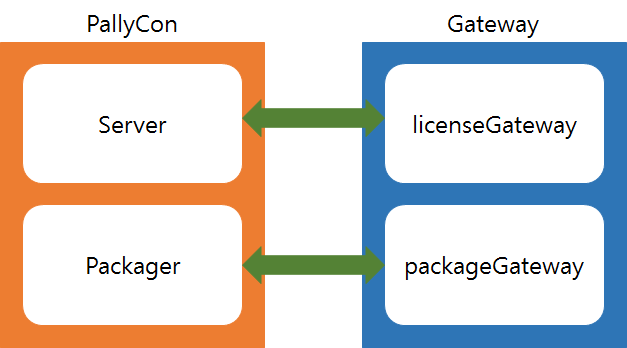

**Gateway PHP Module API**

**( Version 1.0, 2016.08.23 )**

[[TOC]]

1. 개요

PallyCon 서비스 사용 시 pack rule 발급, license rule 발급, application 연동에 필요한 Gateway 페이지를 구성는데 사용 가능한 module 이다.

1. licenseGateway :  Application 에서 컨텐츠 재생 요청 시 라이센스 룰 발급을 위해 PallyCon license server에서는 licenseGateway 페이지로 license Rule 정보를 요청하게 된다.

2. packageGateway : 패키져에서 컨텐츠 DRM 패키징 시 사용될 key 정보를 PallyCon license server에서는 packageGateway 페이지로 키 정보를 요청하게 된다.

2. API 

## Class Gateway

	gateway 에 넘어온 data parsing 과 response data를 생성하는데 사용할 수 있다.

1. file path 

: libs/gateway.php

2. Method 

#### __construct ( string $siteKey )

생성자, 전달받은 siteKey를 이용해 aes 암복호화 객체를 생성.

#### *string *createErrorTemplete ( string $errorCode, string $errorMessage )

error response 규격에 맞춰서 값을 생성한다.

**	Parameter**

<table>
  <tr>
    <td>type</td>
    <td>name</td>
    <td>description</td>
  </tr>
  <tr>
    <td>string</td>
    <td>$siteKey</td>
    <td>사이트 생성시 발급된 site key</td>
  </tr>
</table>

	**Return ***string*

*	*

*	Example.*

<table>
  <tr>
    <td>
require "libs/gateway.php";

$gateway = new Gateway("aaaaaaaaaaaaaaaaaaaaaaaaaaaaaaaa");
//암호화된 최종 response value
echo "result : " . $gateway->createErrorTemplete("1111", "error message");

//암호화 되기 전 response value
echo "  before encrypt value : ". $gateway->getErrorInfo();

//result : hAAEAnhUkWTyy3D9SedII6J6CSqaoUXg5hj5Gm+tkTu8XZWrADCGINBIup3qL4FKa448aAtYE1hZspQq55oglA==
//before encrypt value : {"error_code":"1111","error_message":"error message"}
</td>
  </tr>
</table>

*	*

#### *string* createLicenseRule ( GatewayDTO $gatewayDTO )

 	license rule 연동 response 규격에 맞춰서 값을 생성한다.

**Parameter**

<table>
  <tr>
    <td>type</td>
    <td>name</td>
    <td>description</td>
  </tr>
  <tr>
    <td>GatewayDTO</td>
    <td>$gatewayDTO</td>
    <td>license rule 발급을 위해 setting 가능한 DTO 객체</td>
  </tr>
</table>

**Return ***string*

*Example.*

<table>
  <tr>
    <td>
require "libs/gateway.php";

$gateway = new Gateway("aaaaaaaaaaaaaaaaaaaaaaaaaaaaaaaa");

$gatewayDto = new GatewayDTO();
$gatewayDto->setLimit(true);

//암호화된 최종 response value
echo "result : " . $gateway->createLicenseRule($gatewayDto);;

//암호화 되기 전 response value
echo "  before encrypt value : ". $gateway->getLicenseRule();

//result : euh3OrEWXGWoJWS4rgy/bvU/6bnIyClZR5tydh0g79AhS1nbh971iJpJuHlrpyaF0FQcnSGk9BFYMXbHGll3hcfLGN6xn/uESB6qnv2ET8EEBkl3XDoAER780or3TIL5aZJQw0AgtNCp7VBNb6y3cJawWTdswjFb5VlJy8dv0AOZnpSYIpPzPbkID+kcF7TnLL6gmClgCQ79/KxcD+PJm2En2tQ9bJz8+RMGCFZ+Yeubyogg50ek5A9wyxmbknY6dThov6iDJIbMTcE3Flie1j654O1YfSoFE/i+oL8ZA8w5hD9DpSBLtlYyK3TsjGKvEtY3nGML+HQd+eudn/G4yg==
//before encrypt value : {"error_code":"0000","error_message":"success","playback_policy":{"limit":true,"persistent":false,"expire_date":""},"security_policy":{"output_protect":{"allow_external_display":false,"control_hdcp":"0"},"allow_mobile_abnormal_device":false},"nonce":null}
</td>
  </tr>
</table>

#### *string* createPackageInfo ( GatewayDTO $gatewayDTO )

 	package 연동 response 규격에 맞춰서 값을 생성한다.

**Parameter**

<table>
  <tr>
    <td>type</td>
    <td>name</td>
    <td>description</td>
  </tr>
  <tr>
    <td>GatewayDTO</td>
    <td>$gatewayDTO</td>
    <td>license rule 발급을 위해 setting 가능한 DTO 객체</td>
  </tr>
</table>

**Return ***string*

*Example.*

<table>
  <tr>
    <td>
require "libs/gateway.php";

$gateway = new Gateway("aaaaaaaaaaaaaaaaaaaaaaaaaaaaaaaa");

$gatewayDto = new GatewayDTO();
$gatewayDto->setCid("test-cid");

//암호화된 최종 response value
echo "result : " . $gateway->createPackageInfo($gatewayDto);;

//암호화 되기 전 response value
echo "  before encrypt value : ". $gateway->getPackInfo();

//result : euh3OrEWXGWoJWS4rgy/bvU/6bnIyClZR5tydh0g79AhS1nbh971iJpJuHlrpyaFPPv4/Z7zMLI9UQhsVXvfYRVOdkdIglXFFnt/VNXssqQ=
//before encrypt value : {"error_code":"0000","error_message":"success","cid":"test-cid","nonce":null}
</td>
  </tr>
</table>

#### *string *getCid ()

parseRequestLicense method 실행 시 파싱하여 세팅 되었던 cid 값을 가져온다.

**Return ***string*

#### *string *getDeviceId ()

parseRequestLicense method 실행 시 파싱하여 세팅 되었던 device_id 값을 가져온다.

**Return ***string*

#### *string *getDeviceType ()

parseRequestLicense method 실행 시 파싱하여 세팅 되었던 device_type 값을 가져온다.

**Return ***string*

#### *string *getDrmType ()

	parseRequestLicense method 실행 시 파싱하여 세팅 되었던 drm_type 값을 가져온다.

#### *string *getErrorInfo()

	createErrorTemplate method 실행 시 암호화 되기 전 json 값을 가져온다.

**Return ***string*

#### *string *getFileName ()

parseRequestPackage method 실행시 파싱하여 세팅 되었던 file_name값을 가져온다.

**Return ***string*

#### *string *getFilePath ()

	parseRequestPackage method 실행시 파싱하여 세팅 되었던 file_path값을 가져온다.

**Return ***string*

#### *string *getLicenseRule ()

	createLicenseRule method 실행 시 암호화 되기전 json 값을 가져온다.

**Return ***string*

#### *string *getNonce ()

parseRequestLicense, parseRequestPakcage method 실행 시 파싱하여 세팅 되었던 nonce값을 가져온다.

**Return ***string*

#### *string *getOid ()

	parseRequestLicense method 실행 시 파싱하여 세팅 되었던 oid값을 가져온다.

**Return ***string*

#### *string *getPackInfo ()

createPackageInfo method 실행 시 암호화 되기전 json 값을 가져온다.

**Return ***string*

#### *string *getSiteKey ()

 	객체 생성 시 입력한 site key 값을 가져온다.

**Return ***string*

#### *string *getUserId ()

parseRequestLicense method 실행 시 파싱하여 세팅 되었던 user_id값을 가져온다.

**Return ***string*

#### *bool *parseRequestLicense ( string $requestData )

license rule 연동 시 request data를 파싱 처리 한다.

**Parameter**

<table>
  <tr>
    <td>type</td>
    <td>name</td>
    <td>description</td>
  </tr>
  <tr>
    <td>string</td>
    <td>$requestData</td>
    <td>license rule 정보 요청을 위해 gateway 로 전달되어온 data parameter 값</td>
  </tr>
</table>

**Return ***bool*

*Example.*

<table>
  <tr>
    <td>
require "libs/gateway.php";

$gateway = new Gateway("aaaaaaaaaaaaaaaaaaaaaaaaaaaaaaaa");

//data parameter : {\"user_id\": \"test-user\",\"cid\":\"DEMOtest-cid\",\"oid\": \"\",\"nonce\": \"3426u3050329384g\", \"drm_type\": \"widevine\"}
//encrypt -> yFuWBkRWkW1TTXKC9ZzEAy4/R0WekL0R3yxmmUM21xhcsM0cM4gDr1qsoWExaClhjwDERbucx5tZrPVc2c+wIVyybexs0E6T8HCIZyXjOyYWBqAv03HDbi6x3G+tZdAsHyKK3+42G0eEiOIPAoZTmA==
$requestData = "yFuWBkRWkW1TTXKC9ZzEAy4/R0WekL0R3yxmmUM21xhcsM0cM4gDr1qsoWExaClhjwDERbucx5tZrPVc2c+wIVyybexs0E6T8HCIZyXjOyYWBqAv03HDbi6x3G+tZdAsHyKK3+42G0eEiOIPAoZTmA==";

$gateway->parseRequestLicense($requestData);

echo "user_id : " . $gateway->getUserId() . " ";
echo "cid : " . $gateway->getCid() . " ";
echo "oid : " . $gateway->getOid() . " ";
echo "nonce : " . $gateway->getNonce() . " ";
echo "drm_type : " . $gateway->getDrmType() . " ";

//user_id : test-user
//cid : DEMOtest-cid
//oid :
//nonce : 3426u3050329384gㅌ
//drm_type : widevine
</td>
  </tr>
</table>

#### *bool *parseRequestPackage ( string $requestData )

package 연동 시 request data를 파싱 처리 한다.

**Parameter**

<table>
  <tr>
    <td>type</td>
    <td>name</td>
    <td>description</td>
  </tr>
  <tr>
    <td>string</td>
    <td>$requestData</td>
    <td>package key 정보 요청을 위해 gateway 로 전달되어온 data parameter 값</td>
  </tr>
</table>

**Return ***bool*

*Example.*

<table>
  <tr>
    <td>
require "libs/gateway.php";

$gateway = new Gateway("aaaaaaaaaaaaaaaaaaaaaaaaaaaaaaaa");

//data parameter : {\"file_name\": \"sample-content.mp4\",\"file_path\":\"/cont/sample1/sample-content.mp4\",\"nonce\": \"3426u3050329384g\"}
//encrypt -> gru+GTVi4nAGukble2dHWmkXBbJf8hphGf+Wtnt0h9duJKjzPWoctlGk0YCPD3bgcof3GeKvkwjBpZpidC9WgJp4oVPsnXSUzG9bJn8gqBXMZBG4l114/Y8vj6zYibNkF7gW7mOO6uwkv1aKhMe1tA==
$requestData = "gru+GTVi4nAGukble2dHWmkXBbJf8hphGf+Wtnt0h9duJKjzPWoctlGk0YCPD3bgcof3GeKvkwjBpZpidC9WgJp4oVPsnXSUzG9bJn8gqBXMZBG4l114/Y8vj6zYibNkF7gW7mOO6uwkv1aKhMe1tA==";
$gateway->parseRequestPackage($requestData);

echo "file_name : " . $gateway->getFileName() . " ";
echo "file_path : " . $gateway->getFilePath() . " ";

//file_name : sample-content.mp4
//file_path : /cont/sample1/sample-content.mp4
</td>
  </tr>
</table>

## Class GatewayDTO

	gateway 와의 통신에 필요한 data 객체. getter와 setter로 구성되어 있다.

1. file path 

: libs/gatewayDTO.php

2. Method 

#### __construct ()

생성자

#### *Getter*

#### *bool *getAllowExternalDisplay()

#### *bool** *getAllowMobileAbnormalDevice()

#### string getCid()

#### *string *getCek()

#### *string *getControlHdcp()   

#### *integer* getDuration()

#### *string *getExpireDate()

#### *bool *getHardwareDrm()

#### *string *getHlsAesKey()

#### *string *getHlsAesIv()

#### *bool *getLimit()

#### *string *getMpegCencKey()   

#### *string *getMpegCencKeyId()

#### *string *getMpegCencIv()

#### *string *getNonce()

#### *bool *getPersistent()   

#### *string *getResponseUserId()

#### *Setter*

#### *void *setAllowExternalDisplay($allowExternalDisplay)

#### *void *setAllowMobileAbnormalDevice($allowMobileAbnormalDevice)   

#### *void *setCid($cid)

#### *void *setCek($cek)

#### *void *setControlHdcp($controlHdcp)

#### *void *setDuration($duration)

#### *void *setExpireDate($expireDate)

#### *void *setHardwareDrm($hardwareDrm)

#### *void *setHlsAesKey($hlsAesKey)

#### *void *setHlsAesIv($hlsAesIv)

#### *void *setLimit($limit)

#### *void *setMpegCencKey($mpegCencKey)

#### *void *setMpegCencKeyId($mpegCencKeyId)

#### *void *setMpegCencIv($mpegCencIv)

#### *void *setNonce($nonce)

#### *void *setPersistent($persistent)

#### *void *setResponseUserId($responseUserId)

## Class Aes

aes256(CBC) 암호화 모듈.

1. file path

: libs/aes256.php

2. method

#### 	*string *encrypt( $value )

	aes256 (CBC) encrypt -> base64 encode 된 값을  리턴한다.

**Parameter**

<table>
  <tr>
    <td>type</td>
    <td>name</td>
    <td>description</td>
  </tr>
  <tr>
    <td>string</td>
    <td>$value</td>
    <td>암호화 하기 위한 값</td>
  </tr>
</table>

**Return ***string*

*	Example.*

<table>
  <tr>
    <td>
require "libs/aes256.php";

$encrypter = new Aes("aaaaaaaaaaaaaaaaaaaaaaaaaaaaaaaa","0123456789abcdef");

$encData = $encrypter->encrypt("sample data");
$decData = $encrypter->decrypt($encData);

echo "original data : sample data  ";
echo "encrypt data : ". $encData . " ";
echo "decrypt data : ". $decData . " ";

//original data : sample data
//encrypt data : MManHcZraU/jcWYK/cQRgw==
//decrypt data : sample data
</td>
  </tr>
</table>

#### 	*string *decrypt( $value )

	base64 decode -> aes256 (CBC) decrypt -> 된 값을  리턴한다.

**Parameter**

<table>
  <tr>
    <td>type</td>
    <td>name</td>
    <td>description</td>
  </tr>
  <tr>
    <td>string</td>
    <td>$value</td>
    <td>암호화를 풀기 위한 값</td>
  </tr>
</table>

**Return ***string*

*Example. : encrypt sample 참조.*

